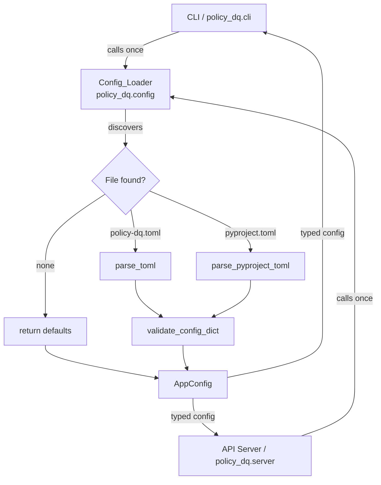

# Design Document: Config File Support

## Overview

This feature introduces a `policy_dq.config` module that discovers, parses, and validates
configuration from `policy-dq.toml` or `pyproject.toml`. The resolved `AppConfig` dataclass
is consumed by the CLI and the new `policy_dq.server` module, keeping all config logic out of
the presentation layer. It also fixes the broken `policy-dq-api` entry point.

The design follows the existing project conventions: business logic in the `policy_dq` package,
no config parsing in CLI/API layers, strict type hints (mypy strict), and pytest for tests.

## Architecture



Discovery walks from `start_dir` (defaults to `cwd`) up to the filesystem root, checking for
`policy-dq.toml` first, then `pyproject.toml`, stopping at the first match.

## Components and Interfaces

### `policy_dq.config` (new module)

```python
# Public interface
def load_config(start_dir: Path | None = None) -> AppConfig: ...
def load_config_from_dict(data: dict[str, Any]) -> AppConfig: ...
def config_to_dict(config: AppConfig) -> dict[str, Any]: ...

class ConfigValidationError(ValueError): ...

@dataclass
class AppConfig: ...
```

**Discovery logic** (`_find_config_file`):
- Iterates `start_dir`, `start_dir.parent`, … up to filesystem root
- At each level checks `policy-dq.toml` then `pyproject.toml`
- Returns `(Path, "toml" | "pyproject")` or `(None, None)`

**Parsing logic**:
- `policy-dq.toml`: parsed with `tomllib` (stdlib, Python 3.11+), entire file is the config dict
- `pyproject.toml`: parsed with `tomllib`, only `tool.policy-dq` table is extracted; all other tables are ignored

**Validation** (`_validate_and_build`):
- Checks for unrecognised keys → `ConfigValidationError`
- Type-checks each field; coerces `str → int` for `int`-typed fields
- Validates `Literal` fields against their allowed sets → `ConfigValidationError`
- Returns populated `AppConfig`

### `policy_dq.server` (new module)

```python
def serve() -> None: ...
```

Calls `load_config()`, then `uvicorn.run("policy_dq.api:app", host=..., port=..., log_level=...)`.
On `OSError` logs at `critical` and calls `sys.exit(1)`.

### `policy_dq.cli` (modified)

- Calls `load_config()` once at group level, stores result on Click context
- Each command reads defaults from `AppConfig`; explicit CLI flags override them
- `validate` command checks `severity_threshold` and exits non-zero when threshold is met

### `pyproject.toml` (modified)

```toml
[project.scripts]
policy-dq-api = "policy_dq.server:serve"
```

## Data Models

### `AppConfig`

```python
from dataclasses import dataclass, field
from typing import Literal

@dataclass
class AppConfig:
    output_format: Literal["console", "json", "markdown"] = "console"
    data_path: str | None = None
    rules_path: str | None = None
    json_output_path: str = "report.json"
    markdown_output_path: str = "report.md"
    severity_threshold: Literal["error", "warning", "info"] = "error"
    api_host: str = "127.0.0.1"
    api_port: int = 8000
    api_log_level: Literal[
        "critical", "error", "warning", "info", "debug", "trace"
    ] = "info"
```

### `ConfigValidationError`

```python
class ConfigValidationError(ValueError):
    """Raised when config file contains invalid or unrecognised keys."""
```

The error message always names the offending key(s) and, for `Literal` fields, lists the
allowed values.

### Severity ordering

For threshold comparison the severity levels are ordered:

```
info < warning < error
```

A `ValidationError` meets the threshold when its severity is equal to or higher than
`AppConfig.severity_threshold`.

## Correctness Properties

*A property is a characteristic or behavior that should hold true across all valid executions
of a system — essentially, a formal statement about what the system should do. Properties serve
as the bridge between human-readable specifications and machine-verifiable correctness guarantees.*

### Property 1: Config discovery finds nearest ancestor

*For any* directory tree where a config file exists at some ancestor level, `load_config`
called from a descendant directory SHALL return an `AppConfig` whose values come from the
nearest ancestor config file, not from a more distant one.

**Validates: Requirements 1.1**

---

### Property 2: pyproject.toml isolation

*For any* `pyproject.toml` file containing arbitrary content in tables other than
`[tool.policy-dq]`, `load_config` SHALL produce an `AppConfig` whose values are determined
solely by the `[tool.policy-dq]` table and are unaffected by any other table's content.

**Validates: Requirements 1.3**

---

### Property 3: Unrecognised keys always raise

*For any* config dictionary containing at least one key that is not a recognised `Config_Key`,
`load_config_from_dict` SHALL raise a `ConfigValidationError` whose message contains every
unrecognised key name.

**Validates: Requirements 1.4, 6.3**

---

### Property 4: Type mismatch always raises with field name

*For any* `(config_key, wrong_type_value)` pair where `wrong_type_value` cannot be coerced to
the declared type of `config_key`, `load_config_from_dict` SHALL raise a `ConfigValidationError`
whose message names the offending key.

**Validates: Requirements 2.2**

---

### Property 5: Integer string coercion

*For any* string that represents a valid integer, supplying it as the value of `api_port` in a
config dict SHALL produce an `AppConfig` with `api_port` equal to the integer value of that
string, without raising an error.

**Validates: Requirements 2.4**

---

### Property 6: Invalid Literal values raise with allowed set

*For any* `Literal`-typed `Config_Key` and any value not in its allowed set,
`load_config_from_dict` SHALL raise a `ConfigValidationError` that names the key and lists
every allowed value.

**Validates: Requirements 2.5**

---

### Property 7: CLI explicit flag overrides AppConfig

*For any* CLI option and any pair of (AppConfig value, explicit CLI value), when the CLI option
is explicitly provided, the effective value used by the command SHALL equal the CLI-supplied
value, regardless of the AppConfig field value.

**Validates: Requirements 3.2**

---

### Property 8: CLI uses AppConfig when no flag provided

*For any* AppConfig with any valid field value, when the corresponding CLI option is omitted,
the effective value used by the command SHALL equal the AppConfig field value.

**Validates: Requirements 3.3**

---

### Property 9: Severity threshold exit code

*For any* `severity_threshold` and any list of `ValidationError` objects, the CLI SHALL exit
with a non-zero status code if and only if at least one error's severity meets or exceeds the
threshold.

**Validates: Requirements 3.5**

---

### Property 10: Round-trip serialisation

*For any* valid `AppConfig` object `c`, `load_config_from_dict(config_to_dict(c))` SHALL
return an `AppConfig` equal to `c`.

**Validates: Requirements 6.2**

## Error Handling

| Scenario | Behaviour |
|---|---|
| Unrecognised config key | `ConfigValidationError` with key name(s) |
| Wrong type for a field | `ConfigValidationError` with key name and expected type |
| Invalid Literal value | `ConfigValidationError` with key name and allowed values |
| `str` value for `int` field that is a valid integer | Silent coercion to `int` |
| `str` value for `int` field that is not a valid integer | `ConfigValidationError` |
| Config file is malformed TOML | `tomllib.TOMLDecodeError` propagated as-is |
| No config file found | Returns `AppConfig` with all defaults |
| Uvicorn fails to bind | Log at `critical`, `sys.exit(1)` |

## Testing Strategy

### Unit tests (`tests/unit/test_config.py`)

Cover specific examples and edge cases:

- `load_config` with no config file returns all defaults (Requirement 1.2, 2.3)
- `load_config` reads `policy-dq.toml` when present
- `load_config` reads `[tool.policy-dq]` from `pyproject.toml` and ignores other tables
- `load_config_from_dict` raises `ConfigValidationError` for unrecognised key (example)
- `load_config_from_dict` raises `ConfigValidationError` for wrong type (example)
- `load_config_from_dict` coerces `"8080"` → `8000` for `api_port`
- `AppConfig()` default values match documented table
- `serve()` calls `uvicorn.run` with correct args (mocked)
- `serve()` logs critical and exits 1 on `OSError` (mocked)
- CLI `validate` exits 0 when no errors meet threshold
- CLI `validate` exits non-zero when errors meet threshold

### Property-based tests (`tests/unit/test_config_properties.py`)

Uses [Hypothesis](https://hypothesis.readthedocs.io/) — minimum 100 iterations per property.

Each test is tagged with a comment referencing the design property:
`# Feature: config-file-support, Property N: <property_text>`

| Test | Property |
|---|---|
| `test_discovery_finds_nearest_ancestor` | Property 1 |
| `test_pyproject_table_isolation` | Property 2 |
| `test_unrecognised_keys_raise` | Property 3 |
| `test_type_mismatch_raises_with_field_name` | Property 4 |
| `test_integer_string_coercion` | Property 5 |
| `test_invalid_literal_raises_with_allowed_set` | Property 6 |
| `test_cli_explicit_flag_overrides_config` | Property 7 |
| `test_cli_uses_appconfig_when_no_flag` | Property 8 |
| `test_severity_threshold_exit_code` | Property 9 |
| `test_round_trip_serialisation` | Property 10 |

Hypothesis strategies needed:
- `st.builds(AppConfig, ...)` — generates valid `AppConfig` instances for round-trip tests
- `st.sampled_from(KNOWN_KEYS)` + `st.text()` — generates dicts with random unrecognised keys
- `st.integers().map(str)` — generates integer strings for coercion tests
- `st.text().filter(lambda s: not s.isdigit())` — generates non-integer strings for type error tests

### Integration tests (`tests/integration/test_cli_config.py`)

- Invoke CLI via `subprocess` or Typer test runner with a temp `policy-dq.toml` in a temp dir
- Verify that config file values are picked up as defaults
- Verify that explicit CLI flags override config file values
- Tests must be deterministic (no random I/O, fixed temp dirs)

### Test structure mirrors `src`

```
tests/
  unit/
    test_config.py          # examples + edge cases
    test_config_properties.py  # Hypothesis property tests
  integration/
    test_cli_config.py      # CLI integration tests
```
